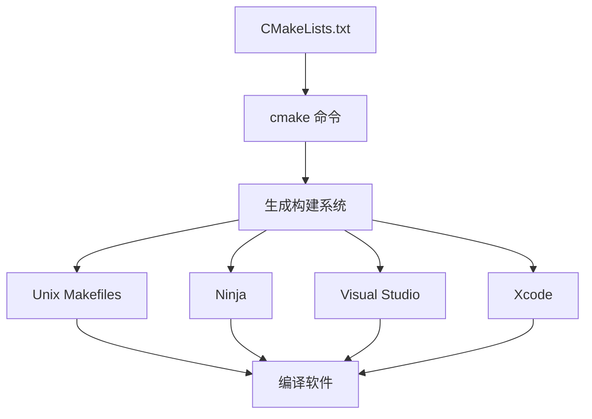
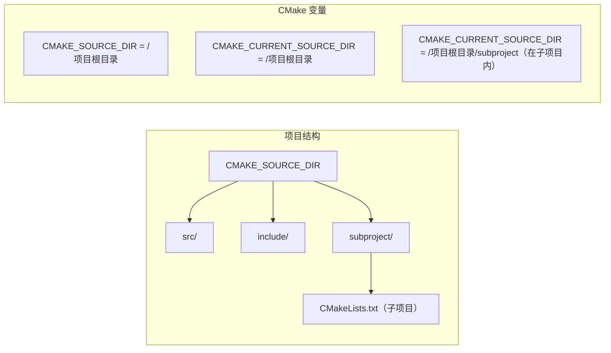
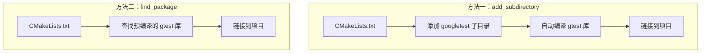
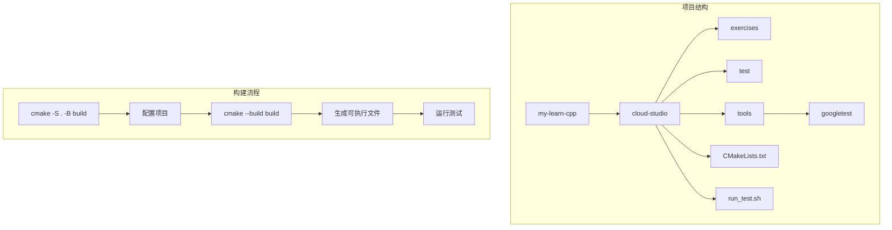

# CMake 使用指南

## 1. CMake 简介

CMake 是一个跨平台的构建系统生成工具，它使用简单的配置文件控制软件编译过程并生成适合本地环境的标准构建文件（如 Makefile、Visual Studio 项目等）。



## 2. CMake 核心概念

### 基本命令

- **cmake_minimum_required**: 设置所需的最低 CMake 版本
- **project**: 定义项目名称
- **add_executable**: 从源文件创建可执行文件
- **add_library**: 从源文件创建库
- **target_link_libraries**: 将库链接到目标
- **include_directories**: 添加包含目录

### 变量

CMake 中的变量是区分大小写的，一些重要的内置变量包括：

- **CMAKE_SOURCE_DIR**: 顶级源目录（包含最上层 CMakeLists.txt 的目录）
- **CMAKE_CURRENT_SOURCE_DIR**: 当前处理的 CMakeLists.txt 所在目录
- **CMAKE_BINARY_DIR**: 顶级构建目录
- **CMAKE_CURRENT_BINARY_DIR**: 当前 CMakeLists.txt 对应的构建目录



## 3. Google Test 集成

集成 Google Test 到 CMake 项目有两种主要方式：

### 方法一：使用 add_subdirectory（子模块方式）

```cmake
# 添加 Google Test 作为子目录
add_subdirectory(${CMAKE_CURRENT_SOURCE_DIR}/tools/googletest)

# 包含 Google Test 头文件
include_directories(
    ${CMAKE_CURRENT_SOURCE_DIR}/tools/googletest/googletest/include
)

# 链接 Google Test 库
target_link_libraries(your_test_executable gtest gtest_main)
```

### 方法二：使用 find_package（预编译方式）

```cmake
# 设置 GTest 安装目录
set(GTEST_ROOT ${CMAKE_CURRENT_SOURCE_DIR}/tools/gtest)

# 查找 GTest 包
find_package(GTest REQUIRED)

# 包含 GTest 头文件
include_directories(${GTEST_INCLUDE_DIRS})

# 链接 GTest 库
target_link_libraries(your_test_executable ${GTEST_BOTH_LIBRARIES})
```



## 4. 文件收集（GLOB）

CMake 提供了 `file(GLOB)` 和 `file(GLOB_RECURSE)` 命令来收集符合特定模式的文件列表。

```cmake
# 收集当前目录下的所有 .cpp 文件
file(GLOB SRC_FILES "*.cpp")

# 递归收集 src 目录及其子目录中的所有 .cpp 文件
file(GLOB_RECURSE SRC_FILES "${CMAKE_CURRENT_SOURCE_DIR}/src/*.cpp")
```

**注意**：CMake 官方不推荐在构建系统中使用 GLOB 来收集源文件，因为在添加新文件时需要重新运行 CMake 配置。更稳健的做法是明确列出所有源文件。

## 5. 构建目录设置

可以通过以下变量设置构建输出目录：

```cmake
# 设置可执行文件的输出目录
set(CMAKE_RUNTIME_OUTPUT_DIRECTORY ${CMAKE_CURRENT_SOURCE_DIR}/build)

# 设置库文件的输出目录
set(CMAKE_LIBRARY_OUTPUT_DIRECTORY ${CMAKE_CURRENT_SOURCE_DIR}/build)

# 设置静态库的输出目录
set(CMAKE_ARCHIVE_OUTPUT_DIRECTORY ${CMAKE_CURRENT_SOURCE_DIR}/build)
```

## 6. 项目实例说明

在当前项目中，我们：

1. 使用 Google Test 作为测试框架
2. 将构建输出定向到 build 目录
3. 收集 exercises 目录中的源代码和 test 目录中的测试代码



## 7. 常见问题

### 问题：'gtest/gtest.h' 文件未找到

**解决方案**：
1. 确保 googletest 子模块已正确克隆：`git submodule update --init`
2. 确保 CMakeLists.txt 中的路径正确指向 googletest
3. 确保包含了正确的头文件目录

### 问题：找不到 GTest 包

**解决方案**：
1. 如果使用 find_package 方法，确保已经安装了 GTest 或正确设置了 GTEST_ROOT
2. 考虑改用 add_subdirectory 方法直接包含 googletest 源码

### 问题：大小写敏感性

CMake 变量是大小写敏感的。标准实践是使用大写字母命名变量（如 GTEST_ROOT 而不是 GTest_ROOT）。