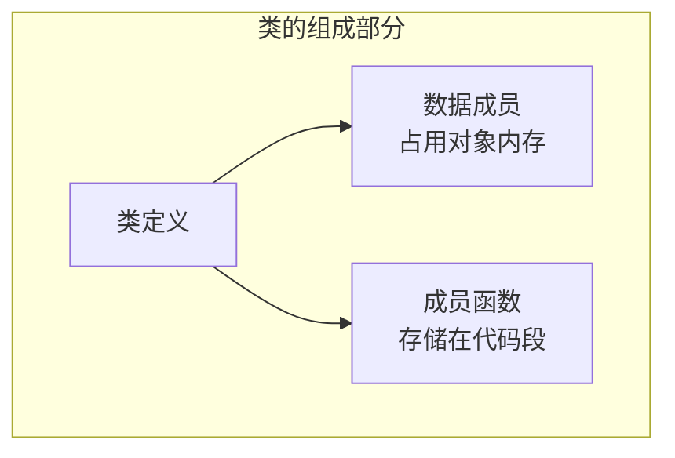
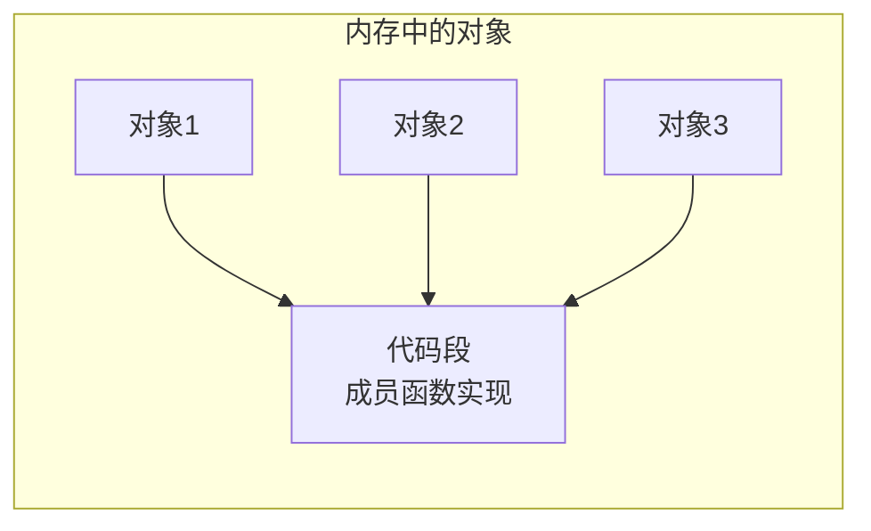
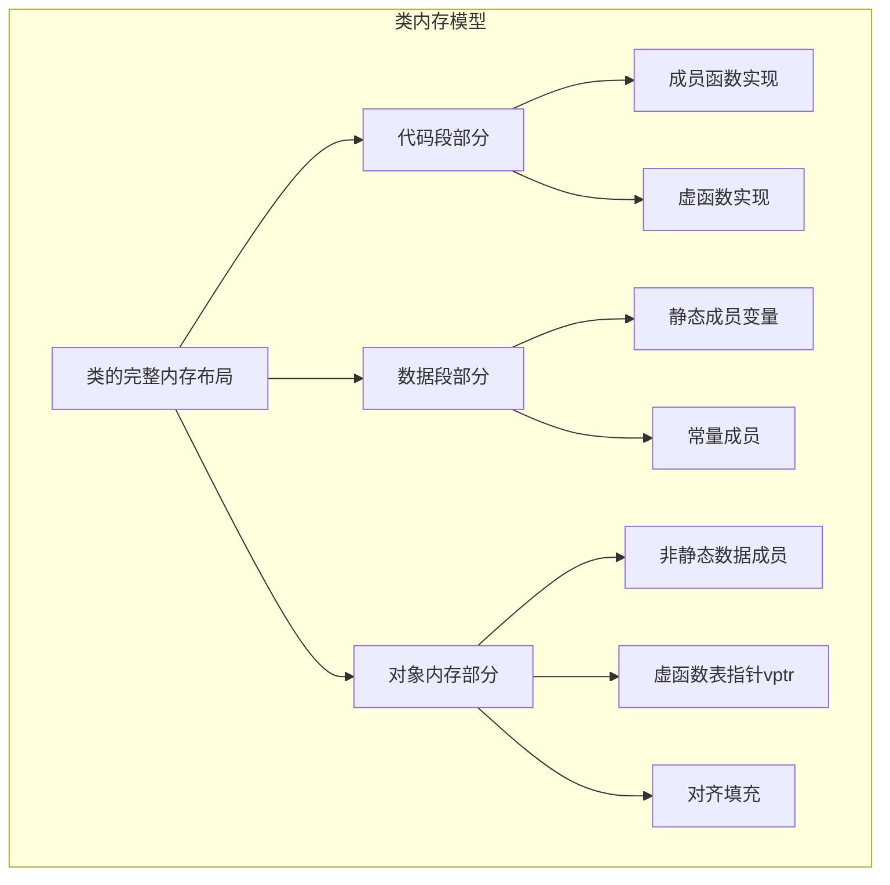
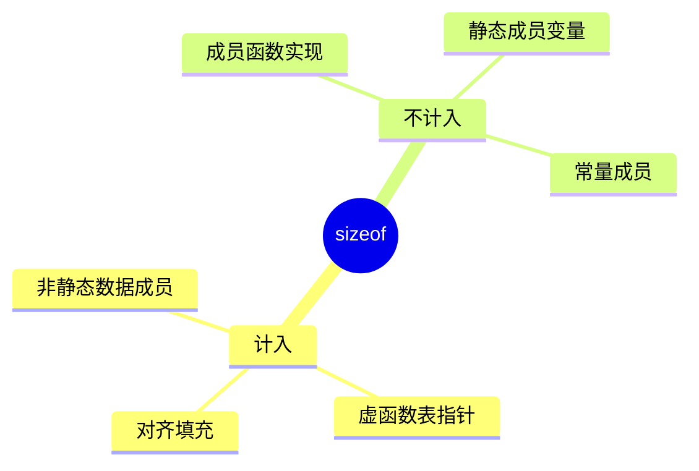

# C++ 类的内存模型详解

## 1. Public 部分为什么不占用内存



### 1.1 成员函数存储原理

```cpp
class Example {
public:
    void method() { }     // 存储在代码段
    int calculate() { }    // 存储在代码段
    
private:
    int data;             // 存储在对象内存中
};
```

成员函数不占用对象内存的原因：
1. 所有成员函数代码存储在代码段
2. 所有对象共享同一份函数代码
3. 成员函数是类的行为，不是对象的状态

### 1.2 代码复用示意



## 2. C++ Class 内存模型

### 2.1 完整内存布局



### 2.2 详细示例

```cpp
class ComplexClass {
public:
    void method() { }                // 在代码段
    virtual void vmethod() { }       // 实现在代码段，vptr在对象中
    static void smethod() { }        // 在代码段
    
    int calculate() { return x; }    // 在代码段
    
private:
    int x;                          // 在对象内存中
    static int count;               // 在数据段
    double value;                   // 在对象内存中
    char flag;                      // 在对象内存中（可能有填充）
};
```

### 2.3 内存布局详解

```
代码段（Text Segment）：
+------------------------+
| method() 的实现        |  - 所有对象共享
| vmethod() 的实现       |  - 只读
| smethod() 的实现       |  - 不计入sizeof
| calculate() 的实现     |
+------------------------+

数据段（Data Segment）：
+------------------------+
| static int count      |  - 所有对象共享
+------------------------+  - 不计入sizeof

对象实例的内存布局（这部分计入sizeof）：
+------------------------+
| vptr                  |  8字节（如果有虚函数）
+------------------------+
| int x                 |  4字节
+------------------------+
| double value          |  8字节
+------------------------+
| char flag             |  1字节
| [padding]             |  7字节（对齐）
+------------------------+
总计：28字节
```

## 3. 内存计算规则

### 3.1 sizeof 计算规则



### 3.2 特殊情况

1. **空类**：
```cpp
class Empty {
public:
    void method() { }  // 不占用对象内存
};
// sizeof(Empty) = 1，确保对象有唯一地址
```

2. **只有虚函数的类**：
```cpp
class VirtualOnly {
public:
    virtual void vfunc() { }  // 只有vptr占用内存
};
// sizeof(VirtualOnly) = 8（64位系统）
```

## 4. 内存优化建议

1. **成员变量排序**：
   - 按大小降序排列减少填充
   - 考虑对齐要求

2. **虚函数使用**：
   - 只在必要时使用虚函数
   - 注意虚函数表指针的内存开销

3. **内存对齐**：
   - 了解编译器的对齐规则
   - 使用 alignas 控制对齐

4. **空基类优化**：
   - 利用空基类优化减少内存占用
   - 注意继承顺序的影响
