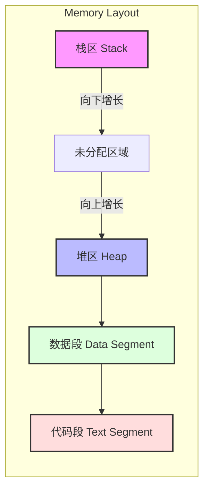
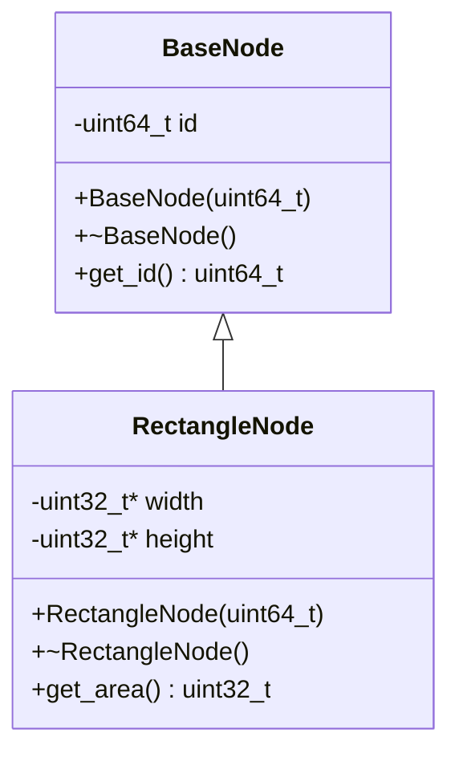
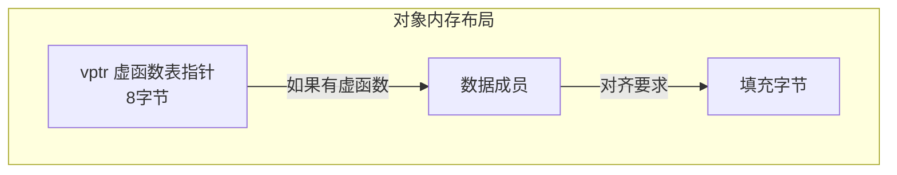
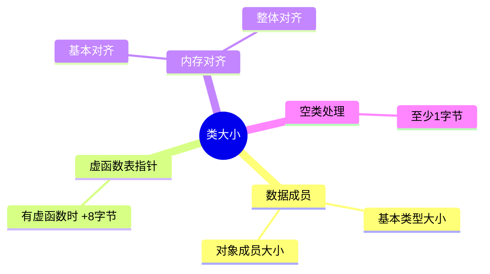
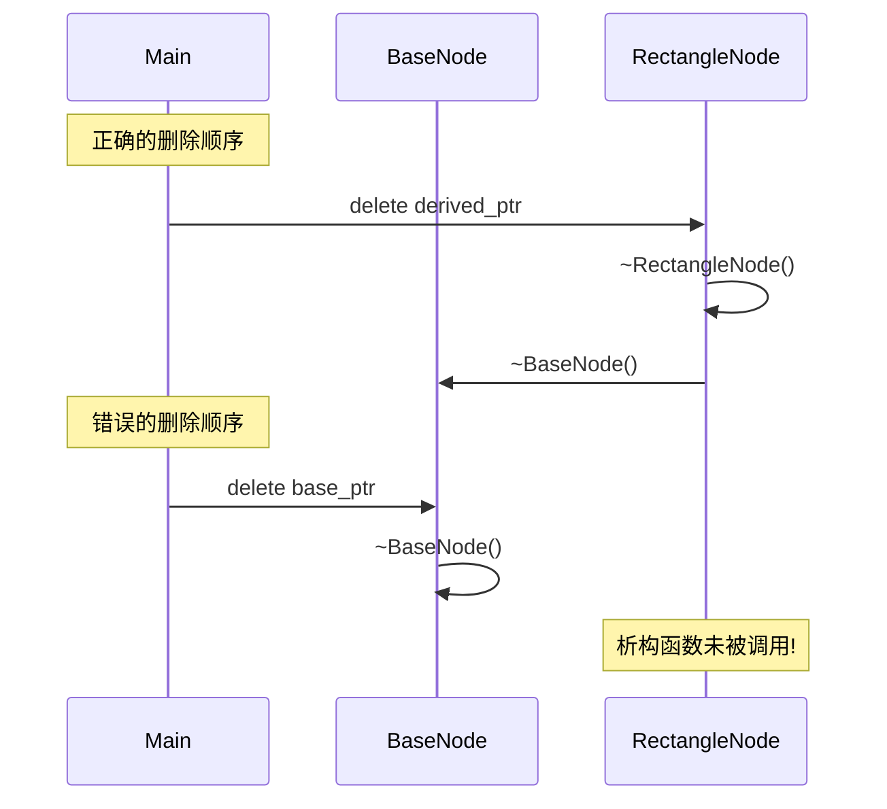
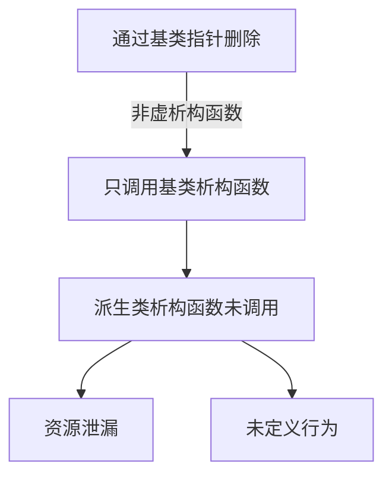
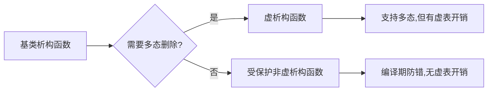

# C++ 内存模型与继承

## 1. C++ 程序的内存布局

### 1.1 各个段的特点

1. **代码段（Text Segment）**：
   - 存储：程序的机器码、类的成员函数实现
   - 特点：只读、所有进程共享
   - 位置：最低地址

2. **数据段（Data Segment）**：
   - 已初始化数据段：全局变量、静态变量、常量
   - 未初始化数据段（BSS）：未初始化的全局/静态变量
   - 特点：可读写、进程独立

3. **堆区（Heap）**：
   - 动态分配的内存（new/malloc）
   - 从低地址向高地址增长
   - 需要手动管理（delete/free）

4. **栈区（Stack）**：
   - 局部变量、函数参数
   - 从高地址向低地址增长
   - 自动管理

## 2. 类的内存布局

### 2.1 对象内存布局

### 2.2 类大小计算

影响类大小的因素：

## 3. 虚析构函数问题

### 3.1 非虚析构函数的问题

### 3.2 解决方案

## 4. 编程最佳实践

1. **析构函数设计**：
   - 基类需要多态删除时使用虚析构函数
   - 不需要多态删除时使用受保护非虚析构函数
   - 注意资源管理和异常安全

2. **内存管理**：
   - 优先使用智能指针
   - 遵循 RAII 原则
   - 注意内存对齐要求

3. **类的设计**：
   - 合理组织数据成员以优化内存布局
   - 注意虚函数的开销
   - 明确所有权语义
